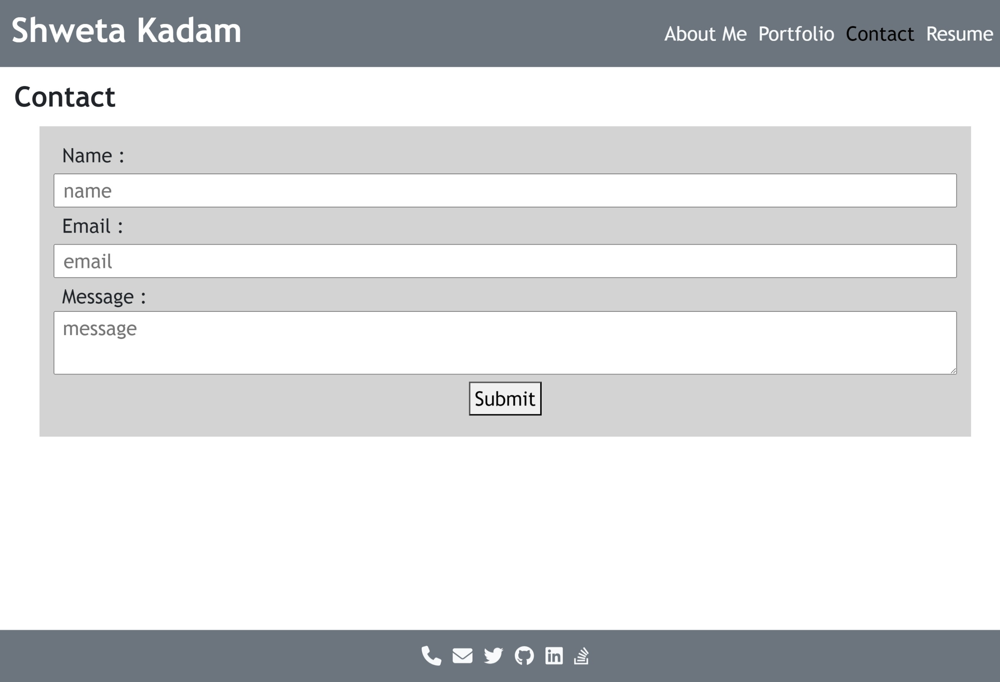

[](https://opensource.org/licenses/MIT)

<p align="left">
    
    
    
    
</p>

# myportfolio-react

## Description

- This project is to build a web application for the portfolio of work has been developed to showcase the skills and talents to employers looking to fill a part-time or full-time position using React.
- React.js, commonly referred to as simply React, is a JavaScript library used for building user interfaces. It allows developers to create reusable UI components, which make up different parts of a web application’s interface. Each component can represent a specific part of the UI, such as a navigation bar, footer, or main content area1. React is declarative, efficient, and flexible, making it a popular choice for front-end development
- This project is deployed on Netlify and the repository used is GitHub.
- During this implementation, I was able to apply my knowledge on React.js and Netlify

## Table of Contents

- [Installation](#installation)
- [User Story](#user-story)
- [Usage](#usage)
- [Usage Screenshots](#usage-screenshots)
- [Acceptance Criteria](#acceptance-criteria)
- [Tests](#tests)
- [Credits](#credits-and-helpful-resources)
- [License](#license)
- [Questions](#questions)

## Installation

Follow these instructions to create your project and deploy it to GitHub Pages:

1. Create a new repository on your GitHub account and clone it to your computer.

2. When you're ready to deploy, use the git add, git commit, and git push commands to save and push your code to your GitHub repository.

3. Navigate to your GitHub repository in the browser and then select the Settings tab on the right side of the page.

4. On the Settings page, select Pages on the left side of the page. On the GitHub Pages screen, choose main in the dropdown under Branch. Click the Save button.

5. Navigate to <your-github-username.github.io/your-repository-name> and you will find that your new webpage has gone live! For example, if your GitHub username is "lernantino" and the project is "css-demo-site", then your URL would be <lernantino.github.io/css-demo-site>.

6. To ensure that the node_modules folder is not pushed in the GITHUB, the .gitignore has to be updated and included.

## User-Story

```md
AS AN employer looking for candidates with experience building single-page applications
I WANT to view a potential employee's deployed React portfolio of work samples
SO THAT I can assess whether they're a good candidate for an open position
```

## Usage

1. Open the terminal and navigate to the project path \*\*\social-network , run the command npm install to create the initial seed data for the application.
2. On completion of seeding, run the command npm start to start the application.
3. Open Insomnia to execute the APIs as per the requirement.

**Link for the repository :**
https://github.com/shwetakadam5/myportfolio-react

**Link for the deployed application :**

https://myportfolio-react-shweta.netlify.app

## Usage Screenshots

#### 1. **_myportfolio-react :About Me:_**


#### 2. **_myportfolio-react :Portfolio:_**


#### 3. **_myportfolio-react :Contact:_**



#### 4. **_myportfolio-react :Resume:_**


## Acceptance-Criteria

```md
GIVEN a single-page application portfolio for a web developer
WHEN I load the portfolio
THEN I am presented with a page containing a header, a section for content, and a footer
WHEN I view the header
THEN I am presented with the developer's name and navigation with titles corresponding to different sections of the portfolio
WHEN I view the navigation titles
THEN I am presented with the titles About Me, Portfolio, Contact, and Resume, and the title corresponding to the current section is highlighted
WHEN I click on a navigation title
THEN the browser URL changes and I am presented with the corresponding section below the navigation and that title is highlighted
WHEN I load the portfolio the first time
THEN the About Me title and section are selected by default
WHEN I am presented with the About Me section
THEN I see a recent photo or avatar of the developer and a short bio about them
WHEN I am presented with the Portfolio section
THEN I see titled images of six of the developer’s applications with links to both the deployed applications and the corresponding GitHub repositories
WHEN I am presented with the Contact section
THEN I see a contact form with fields for a name, an email address, and a message
WHEN I move my cursor out of one of the form fields without entering text
THEN I receive a notification that this field is required
WHEN I enter text into the email address field
THEN I receive a notification if I have entered an invalid email address
WHEN I am presented with the Resume section
THEN I see a link to a downloadable resume and a list of the developer’s proficiencies
WHEN I view the footer
THEN I am presented with text or icon links to the developer’s GitHub and LinkedIn profiles, and their profile on a third platform (Stack Overflow, Twitter)
```

## Tests

Examples of Errors :

#### 1. **_myportfolio-react :Error : Name is required :_**


#### 2. **_myportfolio-react :Error : Email is invalid. :_**


## Credits and Helpful Resources

- [Docs on Netlify](https://vitejs.dev/guide/static-deploy.html#netlify)

## License

> [MIT License](https://opensource.org/licenses/MIT)

## Questions

> _For any queries, please feel free to contact on the following :_
>
> > - Git Hub Profile : <https://github.com/shwetakadam5>
> > - E-mail Address : <shwetakadam5@gmail.com>
